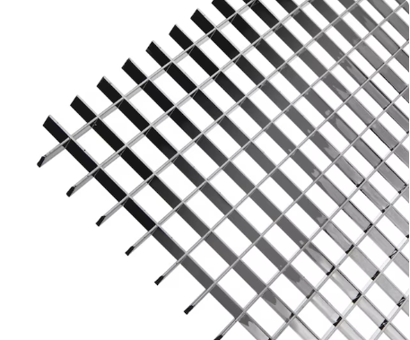

# Vegan Cashew Mold Cheese Base

This base serves as a foundation for various fermented vegan cheeses (Camembert, Blue, etc.) depending on the inoculation used.

  

---

## Ingredients

### Cashew Base

* **3 cups (26 oz)** Raw cashews
* **10 tbsp** Water (start with 6 tbsp/70g, add gradually)
* **2 tbsp** Coconut oil
* **½ tsp** Salt
* **1 tbsp** Light sweet miso
* **1 tbsp** Fermented tofu (optional)

### Inoculations (Select one)

* **Standard Tangy:** 6 capsules probiotics **OR** ¼ tsp mesophilic cultures (Type B)
* **Camembert:** ¼ tsp *Geotrichum Candidum* + ¼ tsp *Penicillium Candidum HP 6*
* **Blue Cheese:** ¼ tsp *Penicillium Roqueforti*

---

## Tools

* [High-speed blender](#high-speed-blender)
* [Fermenting heater](#fermenting-heater)
* [Glass containers for molding](#glass-containers-for-molding)
* [Plastic shrink wrap](#plastic-shrink-wrap)
* [Plastic embroidery canvas or parchment paper](#plastic-embroidery-canvas-or-parchment-paper)
* [Aging containers with internal grids](#aging-containers-with-internal-grids)
* [Cheese cave](#cheese-cave)
* [Sanitizer/Disinfectant](#sanitizerdisinfectant)

---

## Process

### 1. Preparation & Cleaning

* **Soak & Boil:** Soak cashews for several hours, then boil. Drain well.
* **Sanitize:** Disinfect the blender and all utensils thoroughly.

### 2. Blending

* **Emulsify:** Blend warm cashews with water, coconut oil, salt, miso, and optional fermented tofu until smooth.
* *Note: Cashews must be warm enough to melt the oil but not so hot they break the emulsion.*

* **Inoculate:** Add chosen cultures or flavorings and blend briefly to incorporate.

### 3. Primary Fermentation

* **Heat:** Place the blender jar with the paste on a fermenting heater; wrap with towels.
* **Timing:** * **Standard:** 8–24 hours for tang.
    * **Mold-Ripened (Camembert):** 2–4 hours (shorter duration helps prevent black mold).

### 4. Shaping & Setting

* **Homogenize:** Mix the fermented paste to remove any dry surface skin.
* **Mold:** Transfer to glass containers lined with shrink wrap. Fold edges over.
* **Set:** Refrigerate for several hours until firm.

### 5. Salting & Initial Aging

* **First Salt:** Unwrap and salt the top surface.
* **Unmold:** Pull the shrink wrap to remove the wheel; flip onto embroidery canvas/parchment.
* **Second Salt:** Salt the bottom and sides.
* **Cave:** Place on a grid in a covered container and move to the cheese cave.

### 6. Ripening

* **Daily Flip:** Flip the cheese at least once a day (Days 5–9).
* **Mold Growth:** Between Days 10–14, white or blue mold should appear.
* **Spot Cleaning:** If undesired (black) mold appears, remove the spot and salt the area to prevent regrowth.

---

## Tool Details

### High-speed blender
To achieve a smooth paste, it is necessary to use high-speed blender.  In general, those are advertised as 1000+ Watt blenders.

### Fermenting heater
The initial fermentation occurs faster in 105°F to 115°F (40°C - 46°C) temperatures. This can be acheived by using a yogurt maker or a heating pad.

### Glass containers for molding
The most practical container is round glass with 1 cup capacity (like Pyrex).  Larger can be used but flipping the wheels becomes tricky.

### Plastic shrink wrap
Regular shrink wrap for lining the glass container before filling it up with paste.

### Plastic embroidery canvas or parchment paper
The cheese wheels must be ripening on some sort of hard surface so it can be moved and separated easily. The best choice is to use some flexible plastic surface with grid-like texture. My choice is [round plastic embroidery canvas](https://www.google.com/search?q=round+plastic+embroidery+canvas). 

### Aging containers with internal grids
The containers are typical plastic containers, large enough to fit 2-3 wheels with their round embroidery canvas.  The containers are used upside-down and the wheels are placed on the lid so it is easy to remove the wheels. To improve air circulation the wheels rest on pieces of louvered ceiling light panels

  

### Cheese cave
The containers with wheels are placed in Cheese Cave.  For this purpose a refrigerator with tweaked thermostat can be used to keep the temperature in range between 44°F and 53°F (7-12°C).

### Sanitizer/Disinfectant
As a desinfectant can be used alcohol or clearvinigear.
